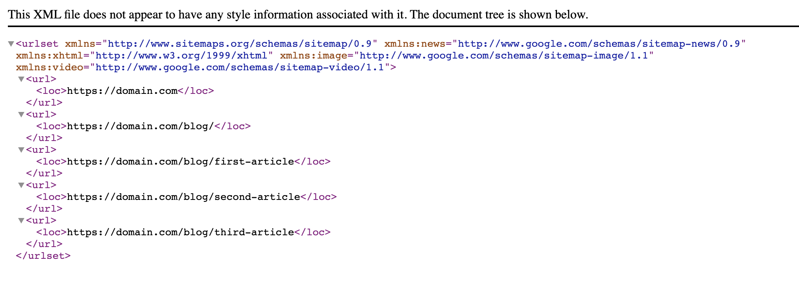

# Sitemap generation for Nuxt3
So far the official [nuxt/sitemap](https://sitemap.nuxtjs.org/) module [does not support Nuxt3](https://github.com/nuxt-community/sitemap-module/discussions/234).

Here is a simple way to add a sitemap to your Nuxt3 app.

## Setup
1. install [sitemap.ts](sitemap.ts) as a dev dependency
```bash
npm install --save-dev sitemap
```

2. create a new file in the modules folder
```bash
mkdir modules && touch modules/sitemap.ts
```

3. copy/paste the content of [sitemap.ts](sitemap.ts)

4. add following lines in you nuxt.config.ts file
```ts
export default defineNuxtConfig({
  // some configs
  modules: ['~/modules/sitemap'],
  sitemap: {
    hostname: 'https://<YOUR_DOMAIN>',
  },
  // more configs
})
```
Don't forget to change <YOUR_DOMAIN> with your actual domain.

5. build your nuxt app and see your sitemap file
```bash
npm run build
```
```bash
npx nuxi preview
```

In your browser go to `http://localhost:3000/sitemap.xml`

### Example
If your pages folder looks like this :

```
pages/
├─ index.vue
├─ blog/
│  ├─ index.vue
│  ├─ first-article.vue
│  ├─ second-article.vue
│  ├─ third-article.vue
```

The generated sitemap will look like this :


## Limitations

- This only works with static pages. An update is planned for supporting pages generated with @nuxt/content v2 (https://twitter.com/yaeeelglx/status/1504819318072217603?s=21).
- This does not work in dev mode (you will not be able to access the sitemap.xml when running `npm run dev`).

## Credits
Most of this code was written by [Florian Lefebvre](https://github.com/florian-lefebvre).
See [original Github Discussion](https://github.com/nuxt/framework/discussions/3582) and [original file](https://github.com/florian-lefebvre/portfolio/blob/c513428dea912a19ffb684b8b571b08b8882158c/modules/sitemap.ts).
